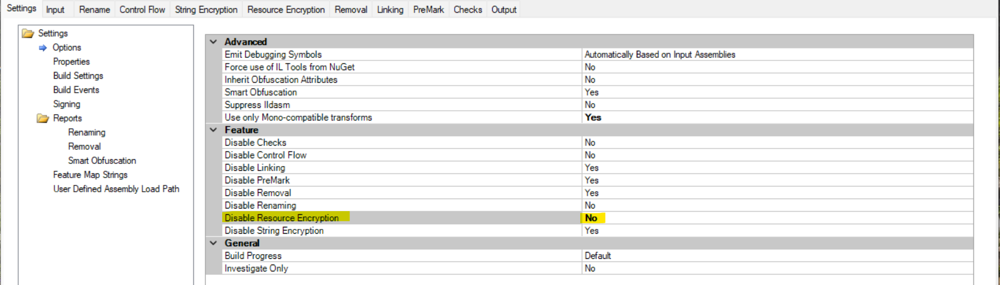
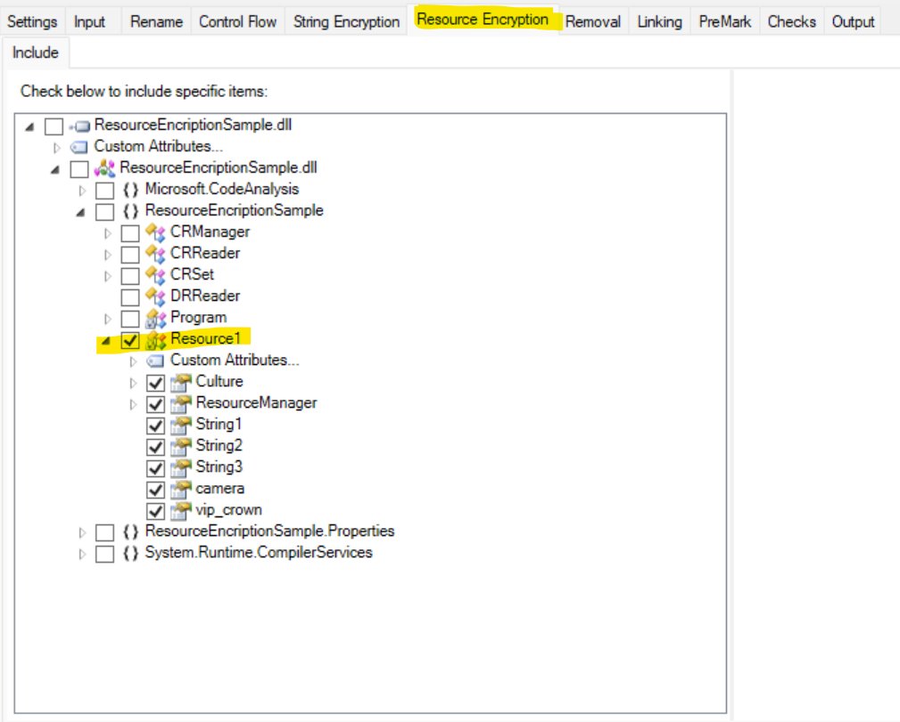

# Resource Encryption Sample

The Resource Encryption Sample demonstrates resource file data which contains string, icon, image type data. If we are using resource file in application then anyone can get the code from it's exe by using reverse engineeting technique using ILSPY like tool.

## Building the Resource Encryption Sample

The resource encryption sample can be built from Visual Studio or by running `msbuild` in the sample's directory. When built in Release mode (i.e. passing `/p:Configuration=Release` to `msbuild`), the application will be processed by Dotfuscator as part of the build.

## Running the Resource Encryption Sample

The resource encryption sample can be run by executing the `ResourceEncryptionSample.exe` assembly produced by the build. The resource encryption program dynamically loads a `Resource1.resx` class properties from the current assembly with the following code:

	
	Console.WriteLine("---------Resource Set---------\n");
	ResourceSet resourceSet = rm.GetResourceSet(CultureInfo.CurrentCulture, true, true);
	if (resourceSet != null)
	{
		foreach (DictionaryEntry entry in resourceSet)
		{
			string key = (string)entry.Key;
			object value = entry.Value;
			Console.WriteLine(key + ": " + value + "\n");
		}
		var enu1 = resourceSet.GetEnumerator();
		while (enu1.MoveNext())
		{
			//Console.WriteLine(enu1.Current);
			Console.WriteLine(((DictionaryEntry)enu1.Current).Key);
			Console.WriteLine(((DictionaryEntry)enu1.Current).Value);
		}
	}
	
Above lines of code print all the properties of `Resource1.resx` class one by one as key and value both.

	
	---------Resource Set---------
	
	String1: ThisisString1
	
	String2: Hey
	
	String3: Guys
	
	vip_crown: System.Byte[]
	
	camera: System.Byte[]
	
	String1
	ThisisString1
	String2
	Hey
	String3
	Guys
	vip_crown
	System.Byte[]
	camera
	System.Byte[]
	
	
## Dotfuscating the ResourceEncryption Output

The resourceencryption sample contains a sample resourceencryption_config config file that demonstrates using resourceencrypt rules to include these properties by resourceencryption. This file is named `ResourceEncryptionSample\resourceencryption_config.xml` and can be located in the same directory as the rest of the resourceencryption samples. The section of the file that include these references is:

Using resourceencrypt Rules to include all the properties Invoked by ResourceEncryption:

	
	<resourceencrypt>
		<includelist>
		<type name="ResourceEncryptionSample.Resource1">
			<propertymember name="Culture" />
			<propertymember name="ResourceManager" />
			<propertymember name="String1" />
			<propertymember name="String2" />
			<propertymember name="String3" />
			<propertymember name="camera" />
			<propertymember name="vip_crown" />
		</type>
		</includelist>
	</resourceencrypt>
	
	
The `<resourceencrypt>` tag indicates that all the includelist propertmember items must be encrypted.

The `<includelist>` tag defines a list of propertymembers that must be encrypted from the resourceencryption process. The `<type name="ResourceEncryptionSample.Resource1">` tag instructs Dotfuscator to include the class name `ResourceEncryptionSample.Resource1` from the resource encryption process. Note that this only refers to the class name itself. All fields belonging to the Resource1 class are still eligible to be encrypted.

Building the `ResourceEncryptionSample.csproj` file with MSBuild in the `Release` configuration will run Dotfuscator with this config file, resulting in an obfuscated output in the `bin\Release` subdirectory.

Running the new assembly verifies that Dotfuscator correctly included the required items from the resource encryption process.

## Configuring the Resource Encryption Sample with the Config Editor

The Dotfuscator Config Editor provides a visual means to produce a config file. Run the Dotfuscator Config Editor from the Start Menu and navigate to the `resourceencryption_config.xml` file via the File -> Open menu. First change the `Disable Resource Encrption` fetaure from `Yes` to `No` under the settings tab options section: 

Expanding the assembly node in the tree shows a graphical view of the application structure, including all resource properties and select the properties to encrypt:

Once you've saved your changes to the config file (e.g., with the File -> Save command in the Config Editor), you need to build your app with the new settings, using your normal build process (Visual Studio, MSBuild, etc.).

## Summary of the Resource Enryption Sample

In order for you to successfully obfuscate an application that have resource file/files, change the settings of `Disable Resource Encryption` fetaure from `Yes` to `No` and select the appropriate resource file/files from the Resource Encryption tab. Dotfuscator provides a fine-grained, rule based facility for doing this.
