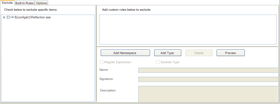
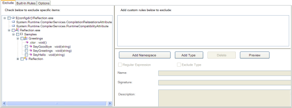
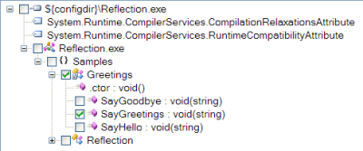

# Reflection Sample

The reflection sample demonstrates issues that occur when using Dotfuscator with applications that make use of dynamic class loading and method invocation.
These powerful technologies allow applications to delay specification of code to be executed until runtime.
In these cases, it is impossible to statically predict what classes and methods might be invoked at runtime; therefore, it is impossible for Dotfuscator to infallibly determine which identifiers should be excluded from renaming.
Fortunately, Dotfuscator has rich facilities for the fine-tuning of renaming rules.

The reflection sample demonstrates how to configure Dotfuscator to selectively exclude types and methods from renaming.

## Building the Reflection Sample

The reflection sample can be built from Visual Studio or by running `msbuild` in the sample's directory. 
When built in Release mode (i.e. passing `/p:Configuration=Release` to `msbuild`), the application will be processed by Dotfuscator as part of the build.

## Running the Reflection Sample

The reflection sample can be run by executing the Reflection.exe assembly produced by the build.
The reflection program dynamically loads a class from the current assembly with the following code:

Reflection Sample Code:

      //get the requested type from current assembly
       assembly = this.GetType().Assembly;
       type = assembly.GetType(typename, true);
       instance = Activator.CreateInstance(type);

It is worth noting that the class that is loaded is specified by the string variable typename.
Looking closer at the sample code shows us that `typename` is initialized to the value `Samples.Greeting`.

Further on in the program, the `SayGreetings` method of `Samples.Greeting` is invoked dynamically with similar code:

Sample.Greeting Code:

       MethodInfo method = type.GetMethod(methodname);
       …
       method.Invoke(instance,methodargs);

As its name suggests, the `SayGreetings` method displays some friendly messages on the console:

SayGreetings Friendly Messages:

    Hello Bob!
    Goodbye Bob!

## Obfuscating the Reflection Output

The reflection sample contains a sample Dotfuscator config file that demonstrates using exclusion rules to exclude these items invoked by reflection.
This file is named **reflection\reflection_config.xml** and can be located in the same directory as the rest of the reflection samples.
The section of the file that excludes these references is:

Using Exclusion Rules to Exclude Items Invoked by Reflection:

    <renaming>
       <excludelist>
          <type name="Samples.Greetings">
             <method name="SayGreetings" signature="string" />
          </type>
       </excludelist>
    …
    </renaming>

The `<renaming>` tag indicates that the exclusion rules contained within pertain specifically to identifier renaming, as opposed to other Dotfuscator features which can also be selectively turned on or off.

The `<excludelist>` tag defines a list of items that must be excluded from the renaming process.
The `<type name="Samples.Greetings">` tag instructs Dotfuscator to exclude the class name `Samples.Greetings` from the renaming process.
Note that this only refers to the class name itself.
All methods and fields belonging to the `Greetings` class are still eligible to be renamed unless they are specifically excluded.
We can see an example of this with the `<method name="SayGreetings" signature="string" />` entry.

Building the `ReflectionSample.csproj` file with MSBuild in the `Release` configuration will run Dotfuscator with this config file, resulting in an obfuscated output in the `bin\Release` subdirectory.

Running the new assembly verifies that Dotfuscator correctly excluded the required items from the renaming process:

Friendly Messages Excluded from Renaming Process:

    Hello Bob!
    Goodbye Bob!

## Configuring the Reflection Sample with the Config Editor

The Dotfuscator Config Editor provides a visual means to produce a config file.
Run the Dotfuscator Config Editor from the Start Menu and navigate to the `reflection_config.xml` file via the File -> Open menu.
Items to be excluded from renaming can be specified using the *Rename* tab of the interface:

Expanding the assembly node in the tree shows a graphical view of the application structure, including all namespaces, types, and methods:

Graphically generating a renaming exclusion list is a simple matter of checking the boxes next to the item to be excluded.
In our reflection example, the required exclusions are made by checking the box next to the type `Greetings` and the method `SayGreetings`:

## Summary of the Reflection Sample

In order for you to successfully obfuscate an application that loads classes by name, invokes methods by name, or references fields by name, you need to manually exclude the appropriate identifiers from renaming.
Dotfuscator provides a fine-grained, rule based facility for doing this.
