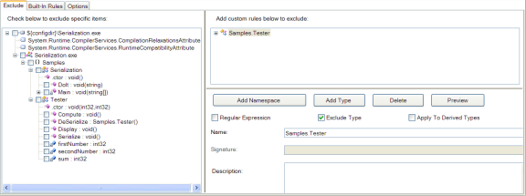
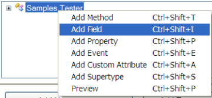
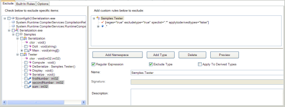

# Serialization Sample

The serialization sample demonstrates using Dotfuscator in an application that makes use of serialized objects that must be exchanged with non-obfuscated code.
If your obfuscated application is the only producer or consumer of the serialized objects, then this sample does not apply.

Serialization must be considered when using Dotfuscator because all of the provided serialization formatters embed type and field information in the persisted data stream.
The implication of this is that classes and fields that are serialized must be excluded from renaming, otherwise it would be impossible to de-serialize objects persisted with non-obfuscated code.
Since method definitions are not persisted, they do not need to be excluded from renaming.

The serialization sample demonstrates how to configure Dotfuscator to selectively exclude types and fields from renaming.

## Building the Serialization Sample

The serialization sample can be built from Visual Studio or by running `msbuild`. 
When built in Release mode (i.e. passing `/p:Configuration=Release` to `msbuild`), the application will be processed by Dotfuscator as part of the build.

## Running the Serialization Sample

The serialization sample can be run by executing the Serialization.exe assembly produced by the build.
The application has two modes of operation controlled by command line parameters.
The `-s` option, causes the application to instantiate an object of type `Tester`, and persist it to the file `Sum.out`.
Each Tester object has 3 integer fields that make up the persisted data.
The following code from the Tester class is used to persist the object:

Tester Class Code:

       // create a file stream to write the file
       FileStream stream = new fileStream("Sum.out",FileMode.Create);

       BinaryFormatter formatter = new BinaryFormatter();
       // serialize to disk
       formatter.Serialize(stream,this);
       stream.Close();

The `-d` option, causes the application to de-serialize an object that had previously been persisted in the file `Sum.out`.
The following code is responsible for doing the de-serialization:

De-Serialization Code:

       stream = new FileStream("Sum.out",FileMode.Open);
       BinaryFormatter formatter = new BinaryFormatter();
       return (Tester) formatter.Deserialize(stream);

## Obfuscating the Serialization Output

The serialization sample contains a sample Dotfuscator config file that demonstrates using exclusion rules to exclude the information that makes up the persisted representation of an object.
This file is named **serialization\serialization_config.xml** and can be located in the same directory as the rest of the serialization samples.
The section of the file that excludes these references is:

Serialization Sample Reference File:

    <renaming>
    <excludelist>
      <type name="Samples.Tester">
       <field name=".*" regex="true" />
      </type>
    </excludelist>
    …
    </renaming>

The `<renaming>` tag indicates that the exclusion rules contained within pertain specifically to identifier renaming, as opposed to other Dotfuscator features which can also be selectively turned on or off.

The `<excludelist>` tag defines a list of items that must be excluded from the renaming process.
The `<type name="Samples.Tester">` tag instructs Dotfuscator to exclude the class name `Samples.Tester` from the renaming process.
Note that this only refers to the class name itself.
All methods of the `Tester` class are still eligible for renaming.
The `<field name=".*" regex="true" />` tag instructs Dotfuscator to exclude all fields contained in the Tester class.
Instead of calling out each field individually, which would become unwieldy in a large class, this example uses a regular expression to specify exclusion.
In this case, it uses the very simple expression `.*` which matches all fields.

Building the `SerializationSample.csproj` file with MSBuild in the `Release` configuration will run Dotfuscator with this config file, resulting in an obfuscated output in the `bin\Release` subdirectory.

Running the new assembly verifies that Dotfuscator correctly excluded the required items from the renaming process.
It is also important to note that the obfuscated application can successfully de-serialize objects persisted with the non-obfuscated application, and the non-obfuscated application can de-serialize objects persisted with the obfuscated application.
The serialized objects are completely compatible with one another.

## Configuring the Serialization Sample with the Config Editor

The Dotfuscator Config Editor provides a visual means to produce a config file.
Run the Dotfuscator Config Editor from the Start Menu and navigate to the `serialization_config.xml` file via the File -> Open menu.
Items to be excluded from renaming can be specified using the *Rename* tab of the interface.
Expanding the assembly node in the tree shows a graphical view of the application structure, including all namespaces, types, and methods:

Graphically generating a renaming exclusion list is a two-step process in order to use the regular expression capability of the interface.
First, create a type exclusion rule to match on the type "`Tester`".
Do this by pressing the **Add Type** button.
This adds a new node to the right-hand panel named simply **Type**.

Next, change the name field of this new node to **Samples.Tester**, reflecting the class to be excluded.
Also, deselect the regular expression option since there is only one class to be excluded:

To add the field exclusion rule, right click on the newly added **Samples.Tester** node.
This will bring up a context menu.

Choosing **Add Field**, causes a new node to be added to the tree.
Change the name to "**.\***" to indicate that this expression should match all fields:

 

Pressing the **Preview** button applies the rules and shows the items that will be excluded in gray in the left-hand tree.
A quick inspection shows this to be the desired outcome, with all fields from **Samples.Tester** excluded:

## Summary of the Serialization Sample

In order to obfuscate an application that exchanges serialized objects with external applications, you need to make sure that the appropriate data elements are excluded from the renaming process.
Dotfuscator provides extremely powerful mechanism for defining these exclusion rules.
By following these guidelines, you can help ensure that your obfuscated application can safely exchange data with non-obfuscated applications with ease.

